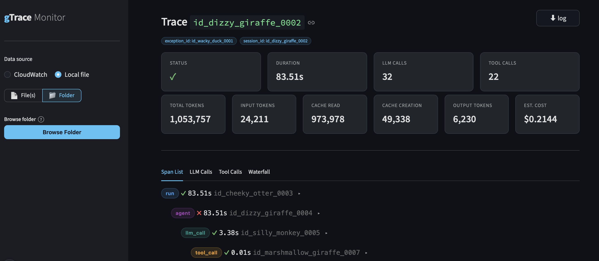

# gTrace Monitor

[](https://www.python.org)
[](https://streamlit.io)
[](https://aws.amazon.com/cloudwatch/)
[](https://github.com/balalaika-tools/gtracer)

A Streamlit monitor for inspecting structured traces produced by [gtracer](https://github.com/balalaika-tools/gtracer) — a lightweight span-based tracer for LangChain/LangGraph agents. Supports both `CloudWatch` (live/cloud) and `local` files written by `GTRACER_LOG_TO_FILE=true`.



---

## Data Sources

| Source | How it works |
|---|---|
| **CloudWatch** | Fetches `TRACE`-level logs via `aws logs filter-log-events` |
| **Local file** | Parses `.jsonl` files written by `gtracer` with `GTRACER_LOG_TO_FILE=true` |

**Filter pattern:** `{ $.level = "TRACE" }`

`LOG_GROUP_NAME` has no default — you must set it in `.env` before fetching from CloudWatch. The app raises a `ValueError` if you attempt a CloudWatch fetch without it. For local file mode no AWS config is needed.

---

## Project Structure

```
src/
└── tracer/
    ├── core/
    │   ├── settings.py          # Env config (Pydantic)
    │   ├── logging.py           # Structured logger
    │   └── constants.py
    ├── ingestion/
    │   ├── cloudwatch.py        # CloudWatch fetch
    │   └── parser.py            # Raw log line → structured trace
    ├── models/
    │   ├── trace.py             # Trace, Span, LLMCall dataclasses
    │   └── filters.py
    ├── analysis/
    │   └── tokens.py            # Token aggregation & cost
    └── ui/
        ├── app.py               # Streamlit entry point
        ├── components/
        │   ├── date_picker.py
        │   ├── filter_bar.py
        │   ├── trace_list.py
        │   └── trace_detail.py
        ├── styles/
        │   └── theme.py
        └── state.py
```

---

## Core Workflow

1. **Date-range selection** — pick start/end date; app fetches and parses matching logs
2. **Trace listing** — shows trace ID, timestamp, status, duration per row
3. **Dynamic filtering** — stack filters by any top-level field (e.g. `session_id`, `exception_id`); AND logic; matching value shown inline
4. **Trace detail** — full span hierarchy, LLM calls, tool calls, token summary, estimated cost

---

## Environment Variables

| Variable | Default | Description |
|---|---|---|
| `AWS_ACCESS_KEY_ID` | — | AWS credentials |
| `AWS_SECRET_ACCESS_KEY` | — | AWS credentials |
| `AWS_SESSION_TOKEN` | — | AWS session token (optional) |
| `AWS_DEFAULT_REGION` | `us-east-1` | AWS region |
| `LOG_GROUP_NAME` | **required** | CloudWatch log group to query |
| `LOG_FILTER_PATTERN` | `{ $.level = "TRACE" }` | CloudWatch filter |
| `LOG_LEVEL` | `INFO` | App log level |
| `MAX_LOG_EVENTS` | `50000` | Max events per fetch |
| `SPAN_CONTENT_MAX_CHARS` | `900` | Truncation limit for span content |
| `PRICE_INPUT` | `1.00` | USD per 1M input tokens |
| `PRICE_OUTPUT` | `5.00` | USD per 1M output tokens |
| `PRICE_CACHE_CREATION` | `1.25` | USD per 1M cache-creation tokens |
| `PRICE_CACHE_READ` | `0.10` | USD per 1M cache-read tokens |
| `S3_BUCKET` | `ai-exception-poc-data` | S3 bucket for reports/config |
| `S3_CONFIG_PREFIX` | `config` | S3 prefix for config objects |
| `S3_REPORTS_PREFIX` | `reports` | S3 prefix for report objects |

---

## Getting Started

### Prerequisites

- [uv](https://docs.astral.sh/uv/getting-started/installation/) — fast Python package manager

```bash
# Install uv (if not already installed)
curl -LsSf https://astral.sh/uv/install.sh | sh
```

### Run

```bash
cp .env.example .env  # fill in credentials
uv sync
uv run streamlit run src/tracer/app.py
```
